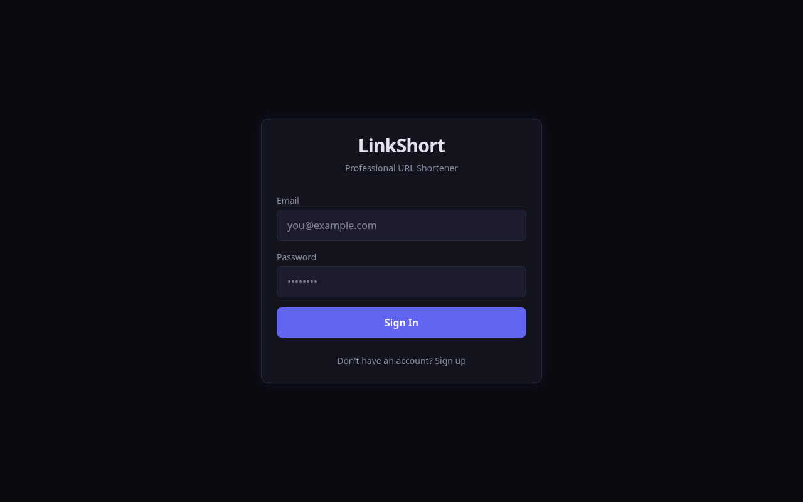
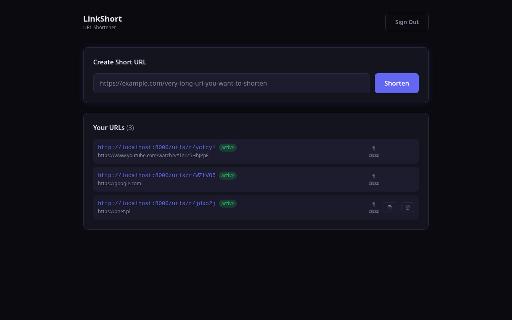
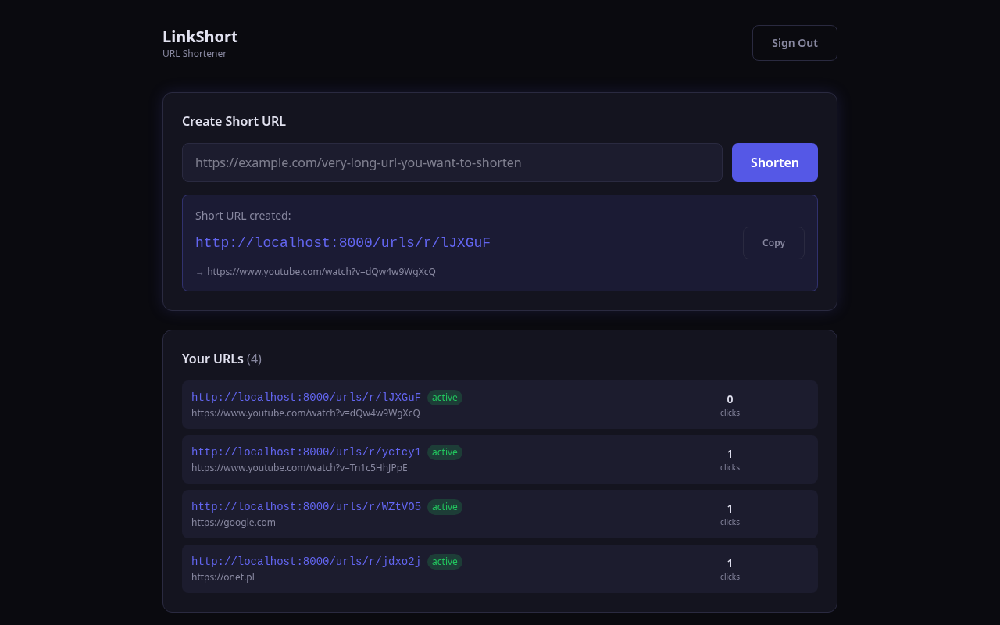

# LinkShort — Skracacz URL


**Skracacz URL z autoryzacją JWT, śledzeniem kliknięć i ciemnym UI. Pełne REST API + SPA w Reakcie.**

| | | |
|---|---|---|
|  |  |  |

## Funkcje

- Autoryzacja JWT — rejestracja, logowanie, dostęp do API przez token
- Skracanie jednym kliknięciem — wklej URL, otrzymaj krótki kod
- Śledzenie kliknięć — każde przekierowanie zwiększa licznik
- Dashboard — zarządzanie URL-ami: kopiowanie, usuwanie, statystyki
- Kopiowanie do schowka — jednym kliknięciem
- Ciemny UI — profesjonalny ciemny motyw, responsywny
- REST API — dokumentacja Swagger pod `/docs`
- SQLite — trwałość bez konfiguracji

## Stack technologiczny

| Warstwa | Technologia |
|---|---|
| Backend | Python 3.12, FastAPI, SQLAlchemy, SQLite |
| Auth | JWT (python-jose), SHA-256 |
| Frontend | React 19, Vite, TailwindCSS 4 |
| Testowanie | pytest, httpx |

## Szybki start

```bash
git clone https://github.com/bartoszosiej/FastAPI-url.git
cd FastAPI-url
python3 -m venv venv
source venv/bin/activate
pip install -r requirements.txt
uvicorn app.main:app --host 0.0.0.0 --port 8000 --reload
```

Otwórz [http://localhost:8000](http://localhost:8000)

### Budowanie frontendu

```bash
cd frontend
npm install
npm run build
rm -rf ../backend/static
mkdir -p ../backend/static
cp -r dist/* ../backend/static/
```

## API

| Metoda | Endpoint | Auth | Opis |
|--------|----------|------|-------------|
| `POST` | `/auth/register` | — | Utwórz konto |
| `POST` | `/auth/login` | — | Logowanie, zwraca JWT |
| `GET` | `/auth/me` | Bearer | Bieżący użytkownik |
| `POST` | `/urls/shorten` | Bearer | Utwórz krótki URL |
| `GET` | `/urls/my` | Bearer | Lista Twoich URL-i |
| `GET` | `/urls/r/{code}` | — | Przekierowanie do celu |
| `DELETE` | `/urls/{code}` | Bearer | Usuń URL |

## Wdrożenie

```bash
# Cloudflare Tunnel (darmowy, bez konta)
cloudflared tunnel --url http://localhost:8000
```

## Testowanie

```bash
pytest tests/ -v
```

## Licencja

MIT

## 🌐 Ekosystem

Ten projekt jest częścią ekosystemu [Portfolio Web Bartosza](https://bartoszosiej.github.io/WebBartosz/).
